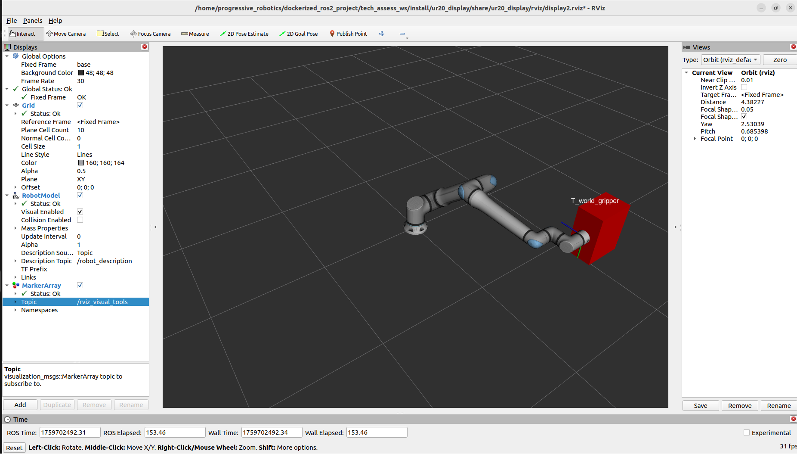

Dockerized ROS2 Project - Technical Assessment for Progressive Robotics

To have rviz in docker run in local host terminal the following:

  ***xhost +local:docker***

To build the image and start the container run:

  ***sudo docker-compose up --build -d***

To run the container service run:

  ***sudo docker-compose exec container_service bash***

Navigate to the ROS2 workspace and build it:

  ***cd ~/root/tech_assess_ws***

  ***colcon build***

source the workspace:

  ***source install/setup.bash***

Test the linear algebra service:

1) Run the client node

  ***ros2 run linear_algebra_service least_squares_client***

2) Open a new terminal inside the container

  ***sudo docker exec -it tech_assess_container bash***

3) navigate, build and source again

  ***cd ~/root/tech_assess_ws***

  ***colcon build***

  ***source install/setup.bash***

4) Run the server node

  ***ros2 run linear_algebra_service least_squares_server***

The intermediate and final results will be printed on the terminal(s).

Test the ur20_display package, in a new terminal (remember to navigate,build and source again) run:

  ***ros2 launch ur20_display ur20_display.launch.py***

Note: Rviz will appear immediately but it will take some time to see the robot model and the calculations (~5 seconds). Also, even though a .rviz configuration file is passed as a paremeter in the rviz node in the launch file, MarkerArray should be opened manually and rviz_visual_tools topic must be selected.

