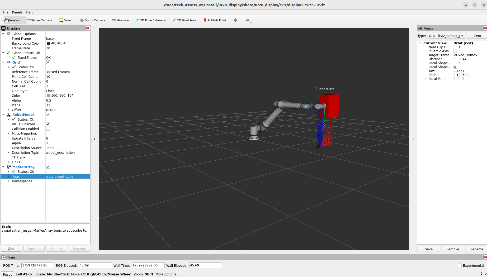

# Dockerized ROS 2 Project
Technical Assessment for Progressive Robotics

A Dockerized ROS 2 workspace that includes:

- `linear_algebra_service` (least-squares client/server example)
- `ur20_display` (UR20 visualization in RViz)

---

## Prerequisites

Before you begin, make sure you have:

- Docker
- Docker Compose (v2+ recommended)
- Linux host with X11 (for RViz GUI forwarding)

> RViz GUI forwarding from containers is platform/display-server dependent.  
> This README assumes an X11-compatible setup.

---

## Quick Start

### 1) Clone the repository

```bash
git clone https://github.com/RoboKon9/Dockerized_ROS2_Project.git
cd Dockerized_ROS2_Project
```

### 2) Allow Docker containers to access your X server (for RViz)

```bash
xhost +local:docker
```

> Security note: this relaxes X server access controls.  
> Revert later with:
>
> ```bash
> xhost -local:docker
> ```

### 3) Build and start the container

```bash
docker compose up --build -d
```

### 4) Open a shell in the service container

```bash
docker compose exec container_service bash
```

---

## Build the ROS 2 Workspace

Inside the container:

```bash
cd /root/tech_assess_ws
colcon build
source install/setup.bash
```

---

## Run the Linear Algebra Service Demo

### Terminal A (Client)

Inside the container (after build + source):

```bash
ros2 run linear_algebra_service least_squares_client
```

### Terminal B (Server)

Open a second host terminal and enter the running container:

```bash
docker exec -it tech_assess_container bash
```

Then in that container shell:

```bash
cd /root/tech_assess_ws
colcon build
source install/setup.bash
ros2 run linear_algebra_service least_squares_server
```

You should see intermediate and final computation results printed in the terminals.

---

## Run the UR20 RViz Display

From a container shell (workspace built and sourced):

```bash
ros2 launch ur20_display ur20_display.launch.py
```

RViz should open immediately.  
The robot model and calculations may take a few seconds (~5s) to appear.

---

## Troubleshooting

- **`rviz` does not open**
  - Confirm `xhost +local:docker` was run on the host.
  - Verify X11 environment variables/volume forwarding are correctly configured in Docker Compose.
- **`ros2` command/package not found**
  - Re-run:
    ```bash
    source /root/tech_assess_ws/install/setup.bash
    ```
- **Build errors**
  - Ensure dependencies are installed in the container.
  - Rebuild cleanly:
    ```bash
    cd /root/tech_assess_ws
    rm -rf build install log
    colcon build
    ```

---

## Project Structure

```text
.
├── tech_assess_ws/
│   ├── src/
│   │   ├── linear_algebra_service/
│   │   └── ur20_display/
├── docker-compose.yml
└── README.md
```

---

## Notes

- Prefer `docker compose` (space) over legacy `docker-compose`.
- If your setup requires `sudo` for Docker commands, prepend `sudo` as needed.
- If a custom RViz config is used by launch files, ensure file paths are valid inside the container.

---

## Screenshot


